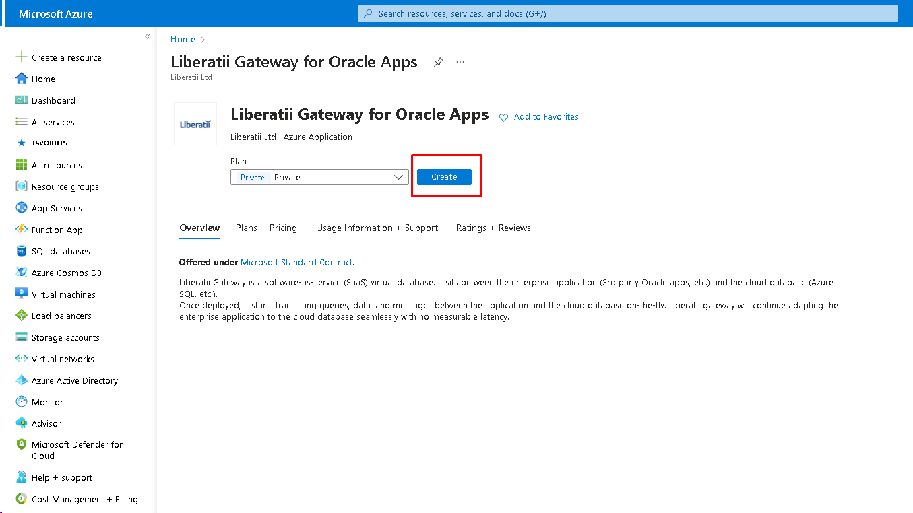
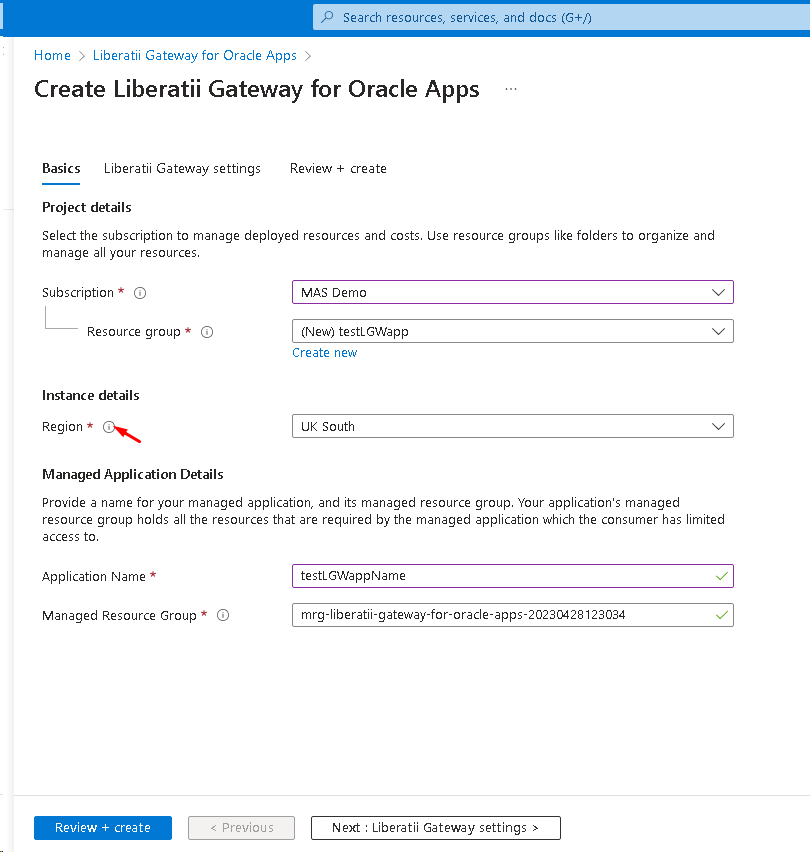
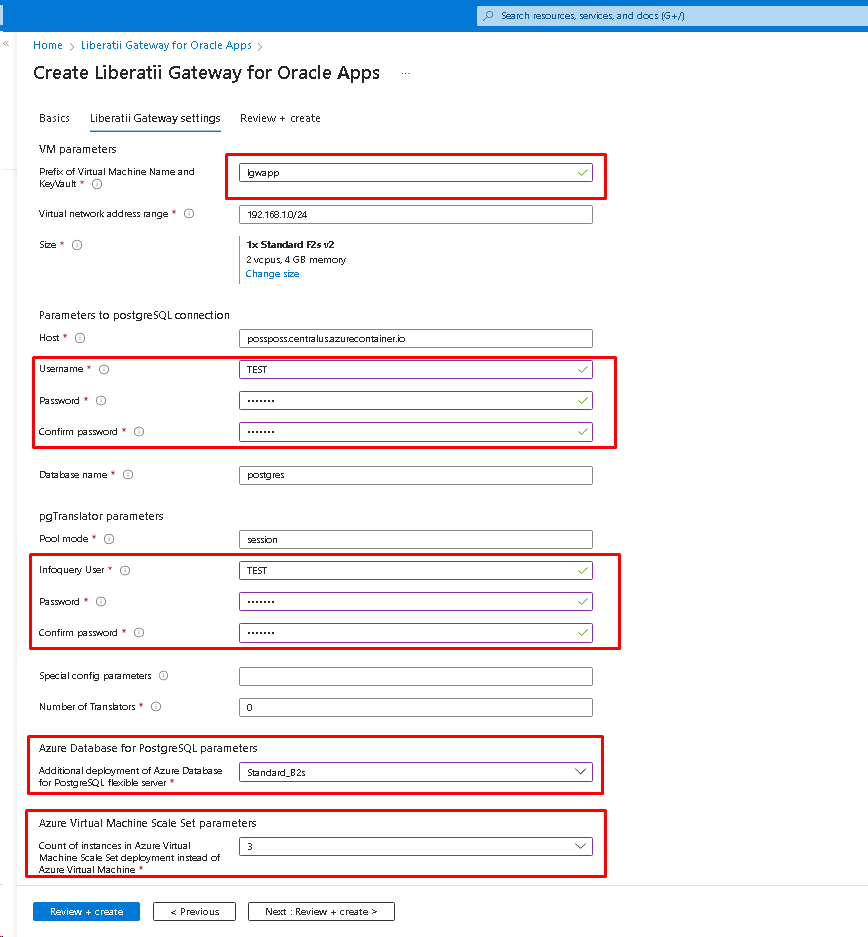
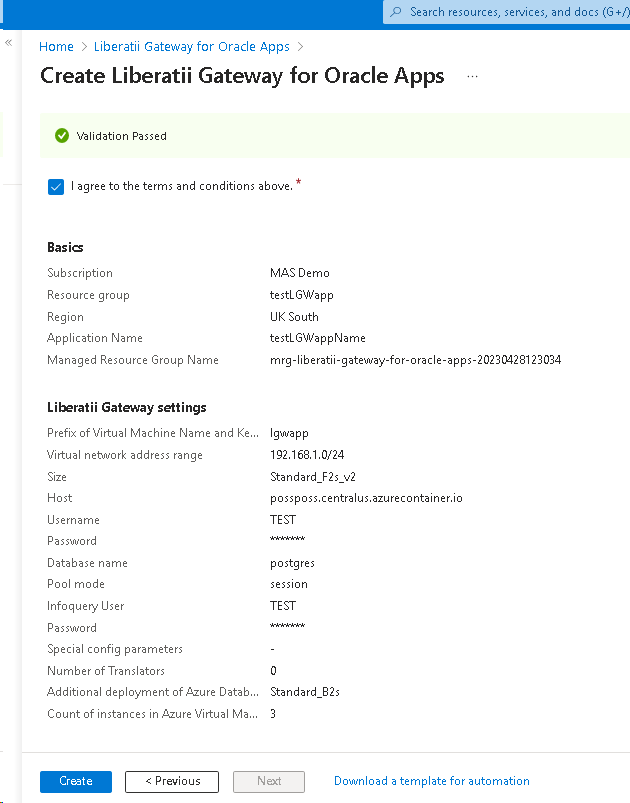
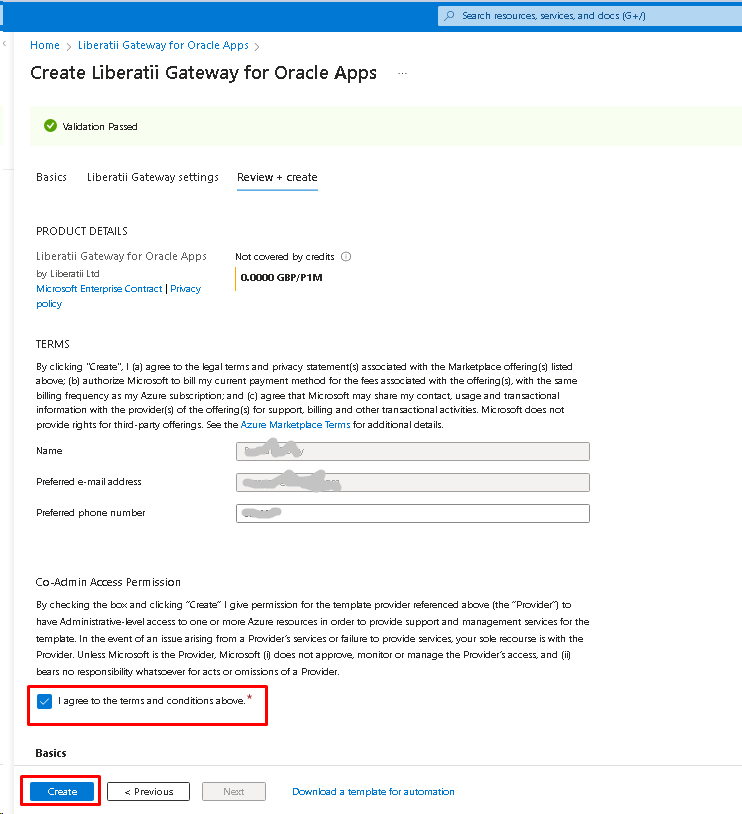
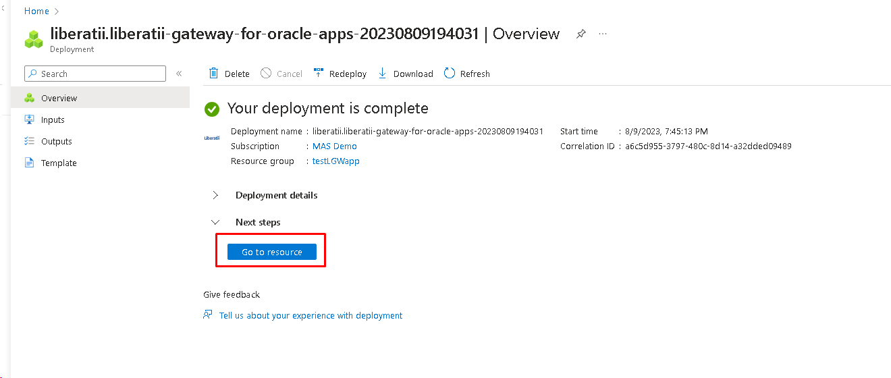
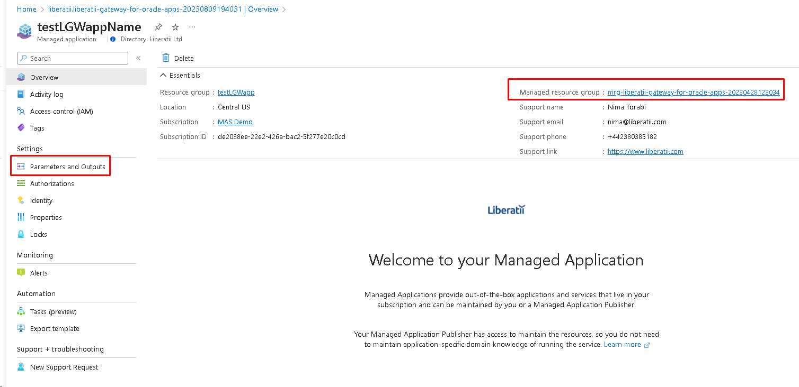
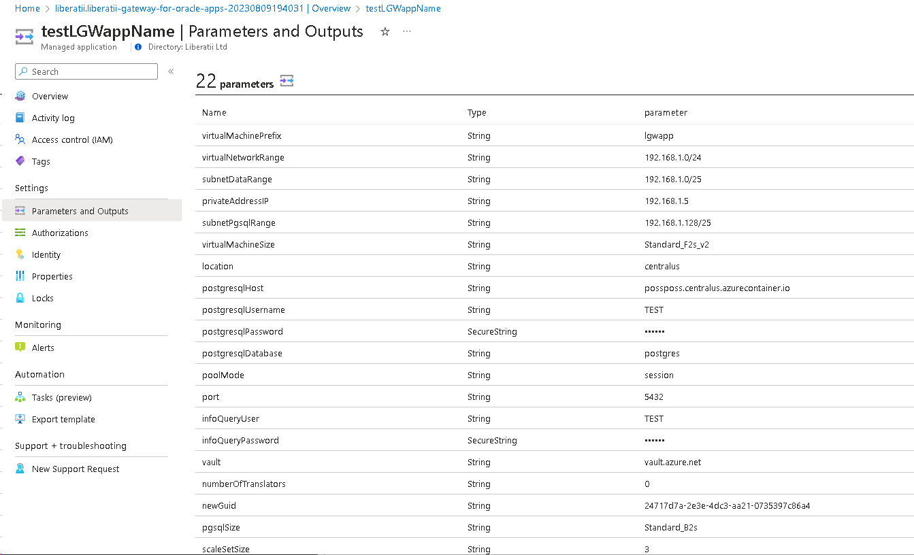
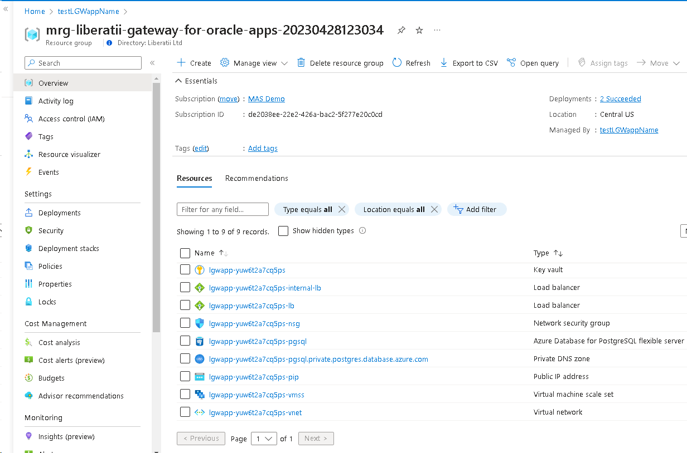

.. _azure-deployment:

Azure Deployment
================

We now use a preview audience list to allow access to our offer before it's published live in the online stores. To have the ability to deploy Liberatii Gateway software on Azure, you have to contact us and share your subscription ID with us. It lets us include it in the preview list and make it visible for you to use. As soon as it's done, you can use the following instruction to deploy Liberatii Gateway.

Here is the start page of the app. To create Liberatii Gateway for Oracle Apps click on the button **Create**.

|
|

On the **Basic** tab point to general information about **subscriptions**, **resource groups**, **regions** etc. Use information hints to get more info. Examples of filling in the fields are in the screenshot below.

To go to specific parameters press the button **Next : Liberatii Gateway settings >**

|
|

On the next tab, it is needed to fill in **VM parameters**. They are self-understandable and info hints can be used to get the details.

Info about **PostgreSQL database parameters** is designed to support two variants of configuration.

One is using a preliminary configured database server. In this case, no PostgreSQL db server will be created. The following fields **Host, Username, Password, Confirm password, Infoquery User, Password, Confirm password, Database name** should be filled in according to the result of the configuration of the database server that was done before (preliminary) by a DBA. Also, **Azure Database for PostgreSQL parameters** should be set to **None**.

Another variant is for deploying Azure Database for PostgreSQL flexible server to be used with Liberatii Gateway. In this case, **Azure Database for PostgreSQL parameters** should be set to **Standard_B2s**, **Database Name** should be set to *postgres* and credentials of User and Infoquery User could be the same.

The **Azure Virtual Machine Scale Set parameters** can be set to **None**. It means that for Liberatii Gateway the virtual machine will be deployed. To use the virtual machine scale set for LGW choose any other value where the number is the number of instances of VMSS.

 

Examples of filling in the fields to deploy Liberatii Gateway with **Azure Virtual Machine Scale Set** and **Azure Database for PostgreSQL flexible server** are on the screenshot below.

After all preparation click on the button **Next : Review + create >**.

|
|

The next tab contains brief info about deployment to review.

it needs to agree to the terms and conditions and press the button **Create** to start the deployment process.

|
|

When the deployment completes, the following page will appear. Click on button Go to resource to navigate components of the deployment.

|
|

Then click on **Parameters and Outputs** to see the details of deployment or **Managed resource group link** to see all components of deployment.

|
|

Here it is an example of **Parameters and Outputs** tab:

|
|

And this example of **Managed resource group** page:

.. toctree::
   :maxdepth: 1
   :hidden:

   Deployment <deployment>
   Configuration <configuration>
   Upgrade <upgrade>
