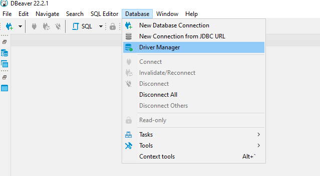
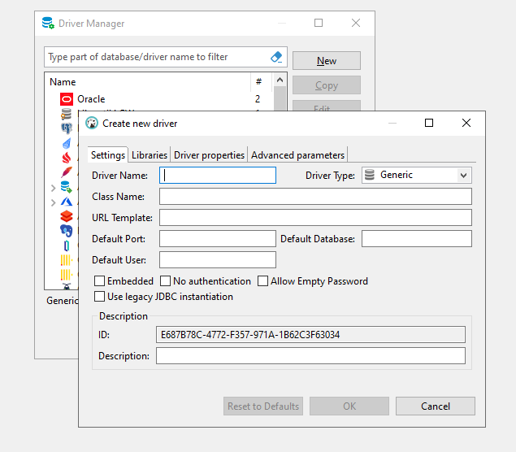
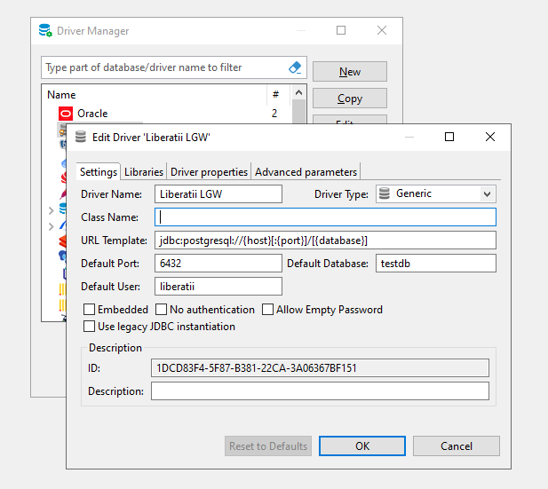
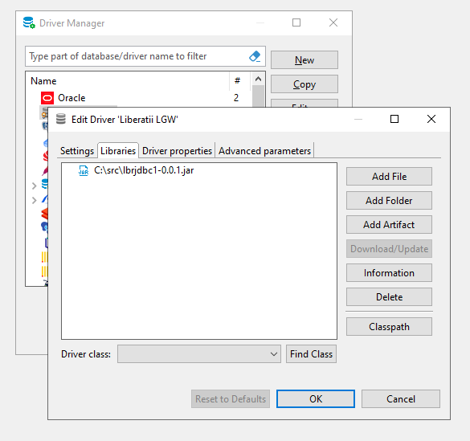
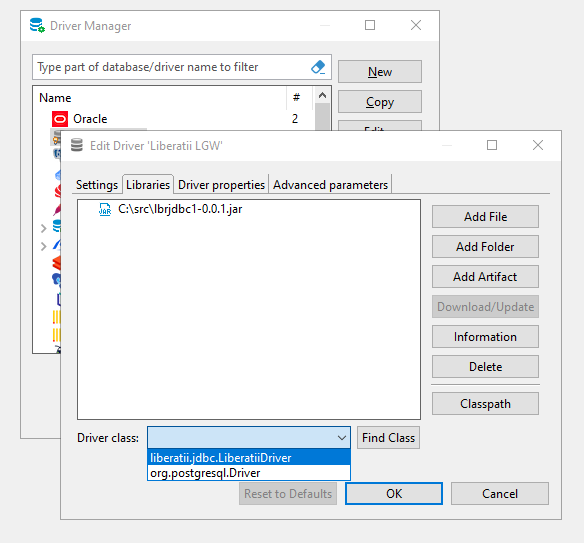
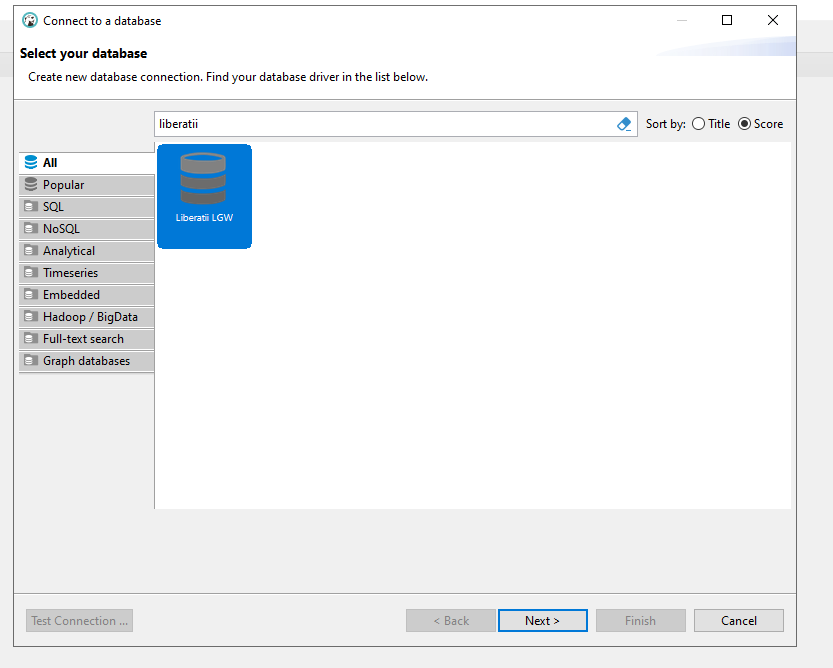
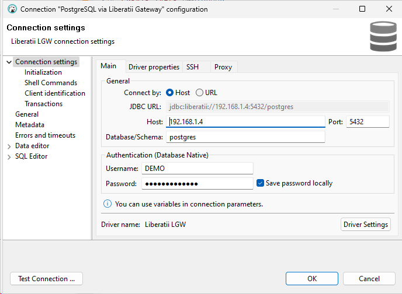
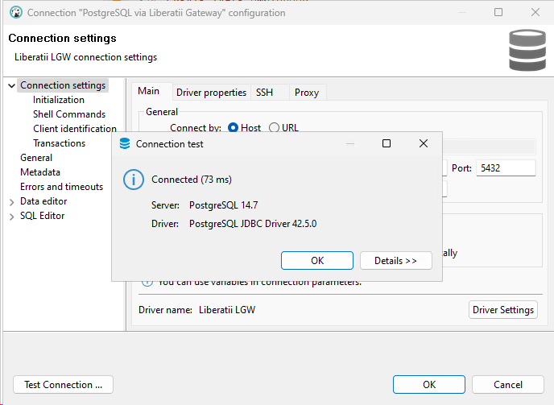

.. _ides:

IDEs
++++

To use LGW in IDE it's enough to replace the driver. However, some IDE also expects the query to be in the target SQL language. 

To replace the JDBC driver in DBeaver, follow the instructions:

- Select Database->Driver Manager

|
|

- Press new driver

|
|

- Fill same as below picture

|
|

- Add liberatii jdbc driver

|
|

- Press the Find class button, and select liberatii.jdbc class

|
|

- Use Liberatti LGW driver for adding new connection

|
|

- Point your parameters of connection (host, port, database, username, password)

|
|

- Press button Test Connection ...

|
|

.. warning::

    WARNING: DBeaver doesn't understand the query is in Oracle syntax, so you cannot just run the whole buffer. For simple queries, it's possible to select them all and press Alt-X. But for complex ones (e.g. PL/SQL DDLs) it works only by selecting a single statement and pressing Ctrl(Command on Mac)-Enter.

|
|
|

