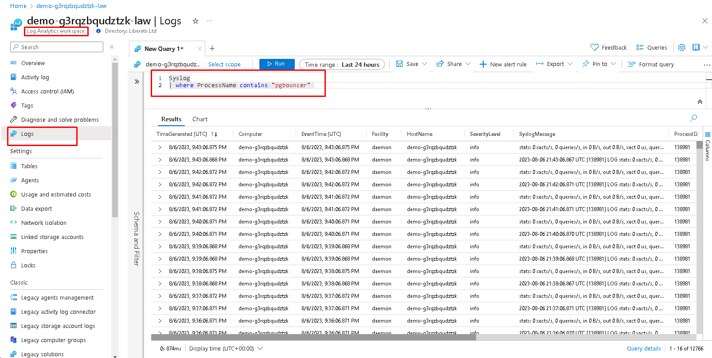
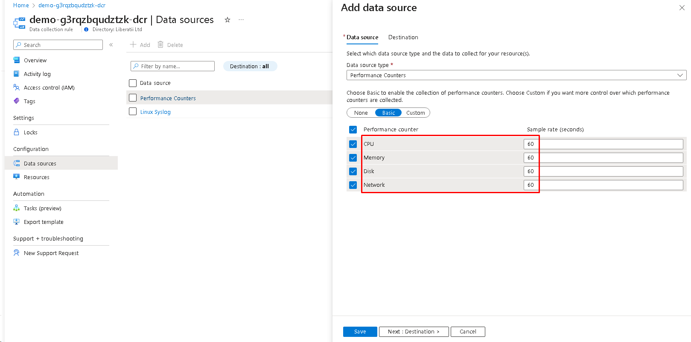
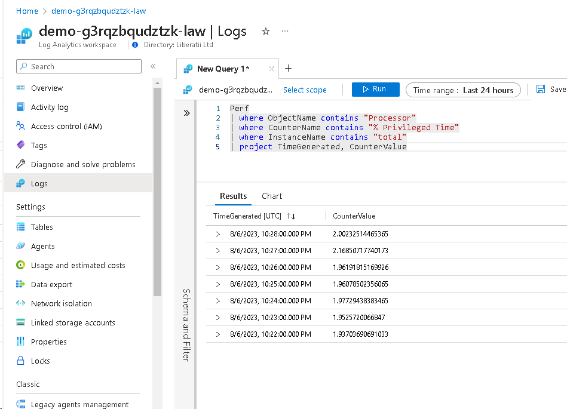
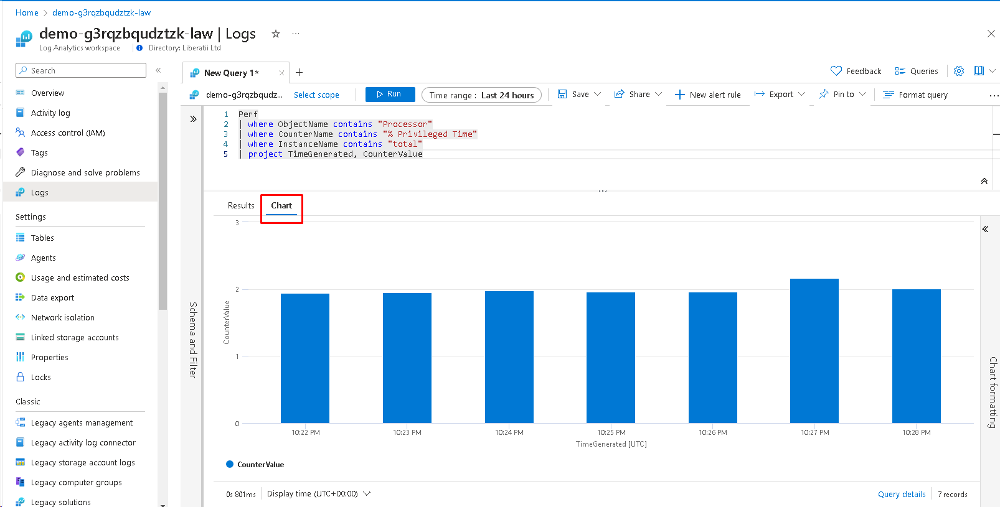

.. _monitoring:

Monitoring
==========

Log Analytics workspace and Data collection rule can be used for monitoring the instance of Liberatii Gateway. For this, choose the component Log **Analytics workspace** in the managed resource group of deployment. Then select tab **logs**. There you can query data from `Syslog`:

To use the **Data collection rule**, choose this component in the managed resource group. Then go to the **Data source** tab and select **Performance Counters**. There you can set necessary items and rates.

To save changes, click on **Next** and then **Save** buttons. After this back to **Log Analytics** (as described before) and then query Pref instead of `Syslog`:

The visualization of query results can be found on the tab **Chart**:

.. warning::

    WARNING: It requires some time to make info accessible in **Log Analytics**. So there could be a delay between doing some action on VM and their reflection in results of querying `Syslog` or/and `Pref`.

