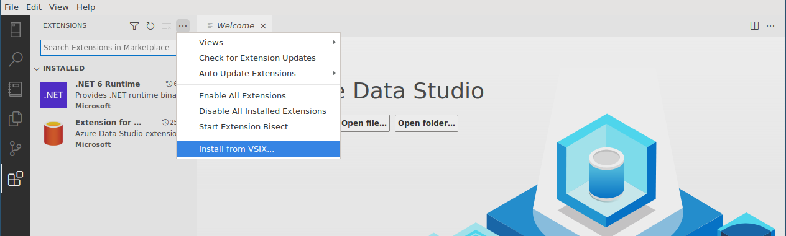
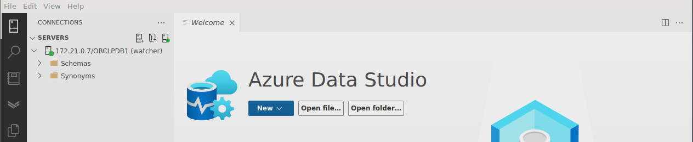
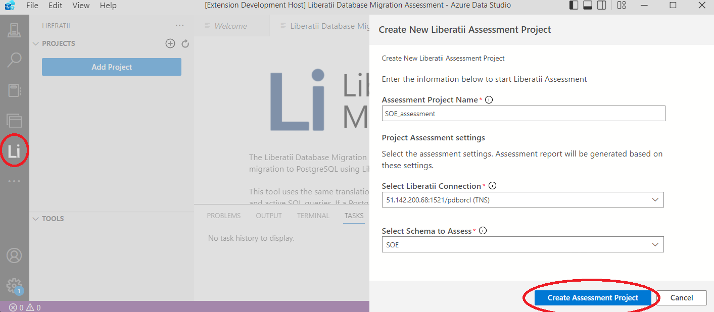
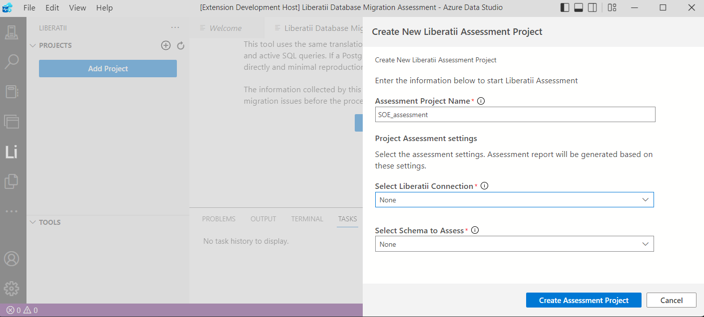
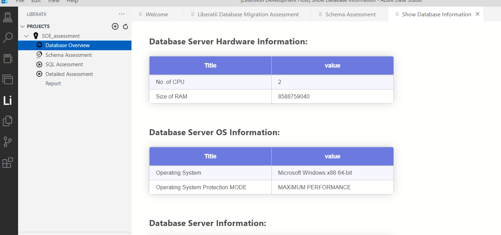
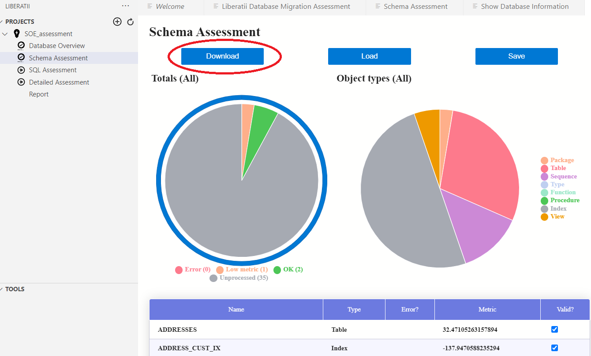
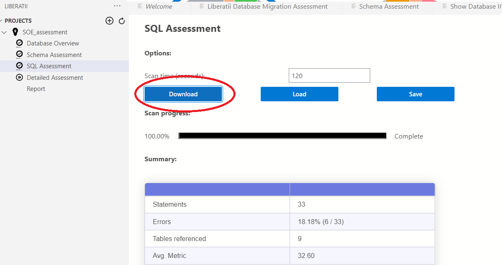
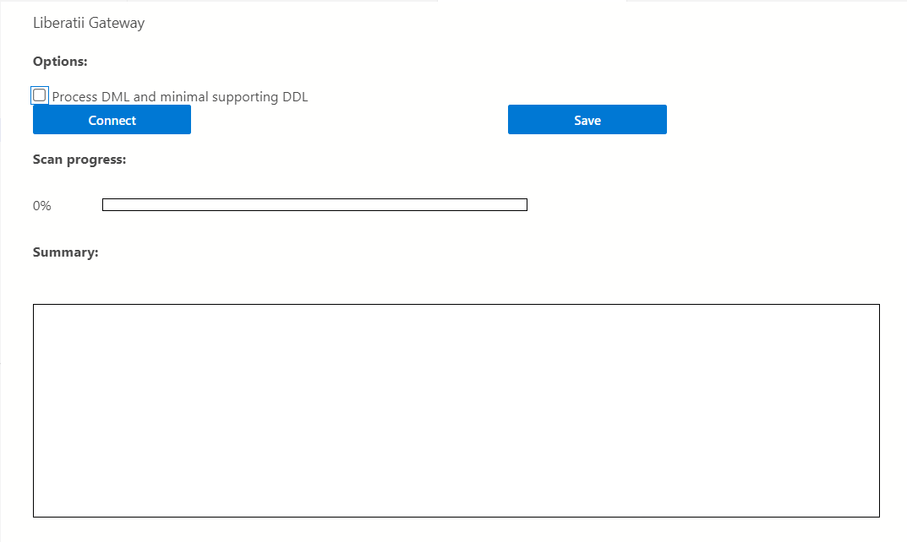

.. _assessment:

Technical Assessment
====================

Migration Assessment extension for Azure Data Studio
----------------------------------------------------

The Liberatii Assessment extension enables you to assess an Oracle Database to determine its compatibility with `Liberatii Gateway <https://www.liberatii.com/>`_.

This extension may be used with or without a database connection.

The extension will either query the database or files containing SQL statements to assess their compatibility with `Liberatii Gateway <https://www.liberatii.com/>`_. It does this by:

**1.** Reading meta-information directly from the database (optional)

**2.** Parsing the statements using the Liberatii Gateway parser

**3.** Mapping the statements to database objects that they reference

**4.** Providing a score for each statement based on its similarity to a set of pre-tested statements

**5.** Running each statement through a Liberatii Gateway (optional) and finding the minimum statement that produces an error

This information can be recorded in a series of JSON files and will only contain:

**1.** Database meta-information (optional)

**2.** The SQL statements that form the database schema (this may be minimized)

**3.** SQL statements stripped of strings and number values

**4.** Minimized statements that fail to translate in Liberatii Gateway

As all information is either minimized or stripped, the JSON files should contain no sensitive information.

Prerequisites
+++++++++++++

Before you begin assessing your Oracle database for migration, you need to

- Verify that your source environment is supported.

- Download and install `Azure Data Studio <https://learn.microsoft.com/en-us/sql/azure-data-studio/download-azure-data-studio>`_ in your environment.

- Obtain permission to connect and query an Oracle database.

- (**Optional**) Ensure that your environment has docker available

Install the extension
+++++++++++++++++++++

Once Azure Data Studio is downloaded and installed, the Liberatii Migration Assessment extension can be installed by downloading the VSIX file and selecting "Install from VSIX..." from the ADS extension menu.

The latest VSIX file can be downloaded from here. `The release page <https://drive.google.com/file/d/1J5Rj7fb0Rtt6q_jVmvxxHqhYiK9XvSqu/view?usp=sharing>`_.

Connect to an Oracle database
+++++++++++++++++++++++++++++

When connecting to a live database, this extension requires the `Extension for Oracle <https://learn.microsoft.com/en-us/sql/azure-data-studio/extensions/extension-for-oracle?view=sql-server-ver16>`_ to be installed to provide connections to the Oracle Databases. It is, therefore, limited to Oracle 11.2 and above.

A connection to an Oracle must already be setup:

|

A new assessment project can now be created using this database and selecting schema to assess:

|

Create an assessment without a live database
++++++++++++++++++++++++++++++++++++++++++++

An assessment project can be created without a database connection by selecting "None" as the database connection:

|

Assessment projects created in this way can only use SQL files to supply DDL (Data Definition Language) and DML (Data Manipulation Language) for assessment.

Read Database Information
+++++++++++++++++++++++++

Database information is downloaded automatically as the first step of the assessment:

|

Assess the schema
+++++++++++++++++

The schema can be assessed by downloading the DDL (Data Definition Language) statements from the database using a dumped DDL file. If you want 
to use a live connection click on the "Download" button and the assessment will start.

Same for using dumped DDL files. Click the "Load" button and select the DDLs file to assess.

The DDL is processed using the same parser as found in Liberatii Gateway, and any errors encountered during this stage will be displayed in the Errors table.

 

By clicking the "Save" button it is possible to save the results of the schema assessment as a .json file for further analyzing or sending the Liberatii team for improvements

Examining DML (Data Manipulation Language) statements
+++++++++++++++++++++++++++++++++++++++++++++++++++++

After the schema is downloaded, any DML statements used by applications attached to the database can be examined. This can be performed by 
downloading DML currently executing in the database ("Download" button) or by providing files of DML statements used by database applications ("Load" button).

|

The DML assessment will parse all DML statements and determine any other database objects that they reference. All statements are made canonical by replacing any values with dummy values so that two statements that differ only in their data are considered identical.

The results table provides the following information:

.. list-table:: 
   :widths: 50 50 50 50
   :header-rows: 1

   * - **SQL**
     - **Count**
     - **Parses**
     - **Metric**
   * - The SQL statement
     - The number of times this statement was encountered in the file or download
     - Whether the statement can be parsed by Liberatii Gateway
     - A score to determine similarity to known test cases

The following tables will present the function, table, and type objects referenced by the statements.

By clicking the "Save" button, it is possible to save the results of the DML assessment as a .json file for further analyzing or sending the Liberatii team for improvements

.. _Running a detailed assessment:

Running a detailed assessment
+++++++++++++++++++++++++++++

.. note::

   NOTE: This requires a docker environment to be present. The :doc:`guide to installing docker</reference/docker>` details installation procedures on a variety of platforms.

The detailed assessment is run by connecting the extension to an instance of Liberatii Gateway. Each DDL and DML statement is run against a real gateway to determine whether the statement is supported.

Installing the docker containers
~~~~~~~~~~~~~~~~~~~~~~~~~~~~~~~~

To perform this assessment, you must download the latest :code:`pgtranslator` and :code:`postgres` containers:

* `Liberatii Gateway container <https://drive.google.com/file/d/1wcKx9yfxsxJL0p_IhUgHqz72Xk0taHmW/view?usp=sharing>`_ 
* `PostgreSQL container <unlinked>`_

Then install them using:

.. code-block::
   :caption: Container install

    docker load -i pgtranslator.tar.gz
    docker load -i postgres.tar.gz

Running the assessment
~~~~~~~~~~~~~~~~~~~~~~

The following options will affect the way in which the DDL is processed:

* "Process DML and minimal supporting DDL" will only process the DDL statements required by the DML statements supplied or downloaded in the previous step. This option is useful if only the currently running applications are in scope to be migrated.
* "Use numerics instead of ints/shorts" will change the translator options to cast to the postgres :code:`numeric` type rather than using :code:`int` and :code:`short`. This option is useful if the code to be migrated makes heavy use of numerical processing without precise casting.

|

The result table provides the following information:

.. list-table:: 
   :widths: 50 50 50
   :header-rows: 1

   * - **Object name**
     - **Error**
     - **Reduced**
   * - The SQL statement
     - The error that occurred
     - A minimized statement that also produces this error

.. _driver-assessment:

Driver Assessment
-----------------

In order to connect an application to Postgres via Liberatii Gateway it is necessary
to replace the **database connector** with a Liberatii connector.

Liberatii supply connectors for :ref:`common connector technologies <database_connector>`, e.g.
:ref:`jdbc`, :ref:`odbc` and :ref:`oci`. In order to correctly switch the connector the
technology in use must be determined and the driver **traced**.

Finding the connector technology
++++++++++++++++++++++++++++++++

Finding the connector technology will vary greatly between applications. The easiest
method is to find a **Connection Properties**, or similarly named, setting in the
database configuration of the application. This is likely to required a
**Connection String** of the following format:

.. list-table::
   :widths: 70 30
   :header-rows: 1

   * - **Connection string**
     - **Driver information**
   * - ``jdbc:oracle:thin:@192.168.100.10:1521:service``
     - JDBC "thin" driver
   * - ``jdbc:oracle:oci8:@//192.168.100.10:1521/service``
     - JDBC "thick" driver
   * - ``Driver={Microsoft ODBC for Oracle};CONNECTSTRING=(DESCRIPTION=...)``
     - ODBC driver using a "TNS" connection string
   * - ``Username/password@//192.168.100.10:1521/service``
     - OCI driver

Many applications may build their own connection string by asking for the components
(hostname, port, etc...) individually. It is also possible to search the filesystem
to find specific files indicating a particular driver is in use:

.. list-table::
   :widths: 50 50 50
   :header-rows: 1

   * - **Filename**
     - **Pattern**
     - **Driver**
   * - ``ojdbc6.jar``
     - Search for ``ojdbc*.jar``
     - Oracle Thin JDBC driver for JDK 6 
   * - ``oci.dll``
     - Search for ``oci.dll`` (``liboci.so`` on Linux)
     - Oracle OCI Driver
   * - ``sqora32.dll``
     - Search for ``*sqora*``
     - Oracle ODBC Driver

Tracing the driver
++++++++++++++++++

Once the driver is determined it is important to trace the driver to ensure that the functionality
required by the application is correctly implemented by the Liberatii Connector.

OCI
~~~

The OCI driver can be traced by replacing the driver with the Liberatii supplied tracing driver. This can
be done by performing the following steps:

1. In the application folder, rename the ``oci.dll`` file to ``ociora.dll``
2. Copy the Liberatii supplied ``oci.dll`` into the application folder
3. Run the application

This will produce an ``oci.db`` file that can be sent to Liberatii containing a trace of the
function calls made by the application. **It does not contain any senstive data**.

JDBC Thick drivers
~~~~~~~~~~~~~~~~~~

In the case of JDBC Thick drivers the same technique the ``oci.dll`` file can also be traced as in the
previous section.
