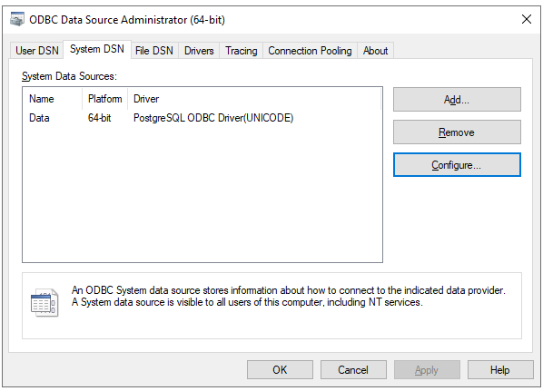
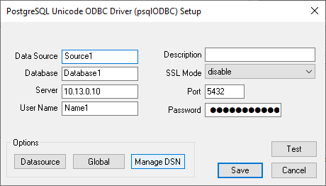
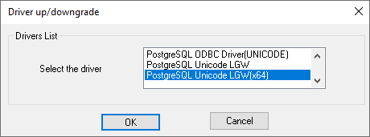

.. _odbc:

ODBC
====

The **Open Database Connectivity (ODBC)** is a standard API that allows applications
to access databases independent of the database used. The system uses an ODBC Data
Source Manager to control database drivers and administer access to databases.

Applications can either use a **Data Source Name (DSN)** which references a
configuration controlled by the manager, or can supply the same information via
a connection string.

The Liberatii Driver
--------------------

The Liberatii ODBC Driver is built on the open source `psqlODBC driver <https://odbc.postgresql.org/>`_
with modifications to support Oracle-specific parameters and the Liberatii Gateway.

Replacing ODBC Drivers on Windows
---------------------------------

1. Installation
+++++++++++++++

The replacement driver is supported on Windows Server 2012 (Windows 8) and above and is
available as an `MSI Package <https://drive.google.com/file/d/1bE9tDZqLkhf5t29SWjbxL1xbPC_ELrOQ/view?usp=share_link>`_.

2. Changing the target database
+++++++++++++++++++++++++++++++

Applications can connect using a **Data Source Name (DSN)** that references system-wide
connection settings or by specifying the connection settings directly in a connection string.

Finding the system-wide DSN or connection string used by the application varies between applications.
Applications will have a method of changing the connection via its settings interface or
configuration files. A **DSN** is a short, human-readable, name whereas a connection string is
a semicolon-separated list of connection parameters.

1. Using a System-Wide DSN
~~~~~~~~~~~~~~~~~~~~~~~~~~

If the application uses a **DSN** the ODBC Data Source Administrator can be used to
modify this DSN. This tool can be found by searching for it in the start-menu or
by typing :code:`Win+R` then :code:`odbcad32`. This tools can configure and add new System DSNs:

Select the data source used by the application then select :code:`Configure`. This will
provide a dialog that can modify the :code:`Server` to point to the Liberatii Gateway
via its IP Address or hostname.

To change the ODBC Driver in use for this connection select :code:`Manage DSN` to open the
driver up/downgrade dialog. The :code:`PostgreSQL Unicode LGW` or :code:`PostgreSQL Unicode LGW(x64)`
driver should be selected as appropriate for your system:

2. Using a connection string
~~~~~~~~~~~~~~~~~~~~~~~~~~~~

If the application specifies the database connection using a **connection string** this can be
modified to look as follows:

.. code-block::
   :caption: Connection string

    Driver={PostgreSQL Unicode LGW(x64)};Server=10.13.0.10;Port=5432;Database=Database1;Uid=Name;Pwd=Password;sslmode=disable;

The :code:`Username`, :code:`Password`, and :code:`Database` should match those used by the Oracle connection.
The :code:`Database` must match the Oracle SID, specified as :code:`SERVICE_NAME`, :code:`Server` or following the :code:`/`
if :code:`DBQ` is specified:

.. code-block::
   :caption: Connection string

    # SERVICE_NAME:
    SERVER=(DESCRIPTION=(ADDRESS=(PROTOCOL=TCP)(HOST=MyHost)(PORT=MyPort))(CONNECT_DATA=(SERVICE_NAME=MyOracleSID)));uid=myUsername;pwd=myPassword;

    # Server:
    Driver={Oracle in OraClient11g_home1};Server=serverSID;Uid=myUsername; Pwd=myPassword;

    # DBQ:
    Driver=(Oracle in XEClient);dbq=111.21.31.99:1521/XE;Uid=myUsername;Pwd=myPassword;

Replacing ODBC Drivers on Linux
-------------------------------

1. Installation
+++++++++++++++

The replacement driver is supported on Redhat Linux 7.0 and above and is available as an
`RPM Package <https://drive.google.com/file/d/1bE9tDZqLkhf5t29SWjbxL1xbPC_ELrOQ/view?usp=share_link>`_. This
can be installed through the system package manager :code:`yum` or :code:`dnf`.

If the application is using :code:`unixODBC`, the installation can be verified buy running :code:`odbcinst -q -d`.

2. Changing the target database
+++++++++++++++++++++++++++++++

Linux applications will generally use a **DSN** name configured in the :code:`unixODBC` or
:code:`iODBC` configuration file: :code:`odbc.ini` or similar. This will vary between distributions
but will most likely be in one of the following locations:

* :code:`~/.odbc.ini`
* :code:`/etc/odbc.ini`
* :code:`/opt/redhat/odbc.ini`

This file can be modified to use the Liberatii PostgreSQL driver by specifying the shared library installed
by the Liberatii RPM package:

.. code-block::
   :caption: Connection block in odbc.ini

   [Liberatii Gateway]
   Driver     = /usr/lib/lgwpsqlodbc.so
   ServerName = 10.13.0.10
   ServerName = localhost
   Port       = 5432
   Database   = Database1
   UserName   = Name1
   Password   = Password
   ServerType = Postgres

Notes
-----

The source code for the Liberatii modifications is available here:

`Source Code <https://drive.google.com/file/d/1D70xQEtRsXYqKQI8eh4AB6UcTD9ZotLc/view?usp=share_link>`_
