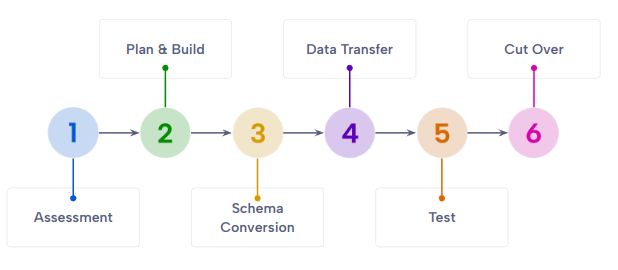
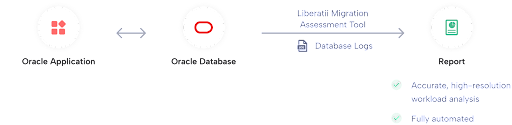
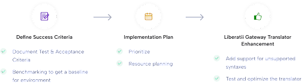
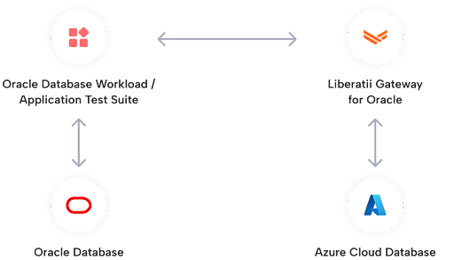
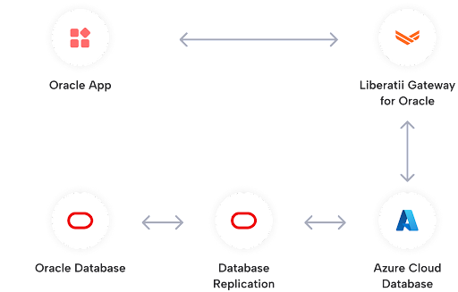

.. _playbook:

Migration Playbook
==================

This document provides information and links to the actions that the Customer, Liberatii or
both parties should perform to ensure an Oracle database and associated application are
migrated quickly and successfully.

Each section will contain:

* Outcomes: The results of the section
* Customer, Liberatii or joint actions: Work that must be completed to generate the results
* Notes, references and troubleshooting information

Pre-requisites
~~~~~~~~~~~~~~

A machine with:

* Azure Data Studio
* The Oracle, PostgreSQL and Liberatii Assessment extensions
* Docker installed
* The Liberatii Docker containers

If these machines are not already set up this process is covered in the
:ref:`technical assessment <assessment>` with specific instructions for the
docker containers :doc:`here </reference/docker>`.

Assessment
~~~~~~~~~~

The assessment phase has two produces two reports: an assessment of the Oracle
database and an assessment of the Application driver. These reports will determine
their suitability for migration to Liberatii Gateway.

The database assessment gathers enough information for Liberatii to ensure that the translator
covers all functionality required by the applications under test and to construct a
specification for a target Postgres database. This provides high confidence that the
migrated applications will behave as expected.

The application driver assessment records a trace of the functionality required
by the application. This ensures that the replacement Liberatii driver will allow
the application to function correctly.

The database assessment report can be anonymized so that even column and table names are removed.

Outcomes
++++++++

* A report that Liberatii can use to create a build plan and upgrade the translator to
  support the target applications.
* Understanding of the Application Driver type (OCI, JDBC or ODBC)
* In the case of OCI or thick JDBC applications, a database file (oci.db) of functionality

Customer Actions
++++++++++++++++

1. Connect Azure Data Studio to the Oracle database
2. Run the Liberatii Assessment
3. Send the resulting report to Liberatii

The full technical assessment guide can be found :ref:`here <assessment>` with
specific information concerning how to install docker :doc:`here </reference/docker>`.

4. Perform the :ref:`Driver Assessment <driver-assessment>`

The driver assessment will determine the type of driver and, if applicable,
create a database of driver functionality.

Plan and Build
~~~~~~~~~~~~~~

During the plan and build step Liberatii will work with the customer to produce
a plan to construct an environment suitable for running the migrated applications.

This step constructs the **migration notebook**, a live document that tracks the
progress of the migration. It contains tools to facilitate the remaining steps: schema
migration, data transfer and testing.

The notebook references the **migration success criteria**, a spreadsheet produced
in this step that contains technical proofpoints to ensure that the migration
meets the needs of the customer. During each stage it is essential that the 
customer and Liberatii agree that the relevant criteria can be signed off.

The following criteria will be supplied in the **success criteria** document that should
be acknowledged and agreed upon by both parties:

* Scalability
* Integration with the existing IT ecosystem

A sample of the success criteria can be downloaded
`here <https://docs.liberatii.com/playbook/success-criteria-template.xlsx>`_
and a sample migration notebook can be downloaded
`here <https://docs.liberatii.com/playbook/migration-template.ipynb>`_.

Outcomes
++++++++

* A Postgres environment suitable for the target applications
* A Liberatii Gateway connected to the Postgres environment
* A Liberatii Data Platform that can control the Gateway
* The migration notebook
* The migration success criteria

Liberatii Actions
+++++++++++++++++

1. Correct any issues that were detected by the Assessment
2. Create a build plan for the Postgres Database and Liberatii Gateway

Joint Actions
+++++++++++++

3. Deploy the Postgres Database according to the build plan
4. Deploy the latest Liberatii Gateway and Liberatii Data Platform

Schema Conversion
~~~~~~~~~~~~~~~~~

The schema conversion takes place by extracting the DDL from the source
Oracle database and running it through Liberatii Gateway.

**Criteria:**

* Data Types
* Code Objects
* DDL Statements

Customer Actions
++++++++++++++++

The **success criteria** document provides guidance to understand the 
requirements of this stage in the "Functional Compatibility (database)" section.
When assessing the schema migration it is essential that both parties agree
on the scope of the transformation. This includes the Data Types, Code Objects
and DDL statements defined in the required schemas and referenced by the
application and associated tests.

The Liberatii Data Platform can be instructed to perform the schema
migration as follows:

1. Open the notebook available on the Liberatii Data Platform
   (This may be the same IP as the Liberatii Gateway, depending on the
   environment construction)
2. Ensure that the details are correct:

   1. The Username, Password, IP address and Port of the Postgres Database
   2. The IP address of the Liberatii Gateway

3. Run the "Test connectivity" steps, if these do not succeed, double check
   the previous details and the machine's status in the Azure console

4. Run the "Configuration" and "Schema Migration" steps

5. Examine the results of the "dbt.migration_objects" table

This step can be performed by connecting Azure Data Studio to the target
Postgres database and examining the table. Alternatively, the query can
also be run using the notebook.

Joint Actions - Troubleshooting
+++++++++++++++++++++++++++++++

At this stage schema errors should be rare, as they will have been picked up
by the assessment tool before this stage began. However, if they do occur
they can most likely to corrected by some simple modifications to the schema
data. Alternatively, some objects may not be required for the proper functioning
of the application and can be ignored.

1. Examine the "dbt.migration_objects" table to find any objects that failed to migrate

.. code-block::
   :caption: Examining the migration table

    select object_name, error, ddl1 from dbt.migration_objects where error <> ''

2. Examine the cause of the error:

Required type casts missing
---------------------------

The error will appear as follows:

.. code-block::

    ERROR:  function someFunctionName(...) does not exist
    LINE .: select someFunctionName(...
    HINT:   No function matches the given name and argument types.
            You might need to add explicit type casts.

The list of possible function overloads and their arguments can be viewed using the
following query:

.. code-block::

    SELECT routines.routine_name, parameters.data_type, parameters.ordinal_position
    FROM information_schema.routines
    LEFT JOIN information_schema.parameters ON routines.specific_name=parameters.specific_name
    WHERE routines.routine_name ilike 'someFunctionName'
    ORDER BY routines.routine_name, parameters.ordinal_position

By wrapping the parameter in a cast, e.g.  :code:`CAST(expression AS INTEGER)` it is
often possible to overcome this error.

Data Transfer
~~~~~~~~~~~~~

The data transfer stage is performed using the **Migration Notebook**. This must only
be performed once the **Schema Conversion** has taken place and the results are 
correct.

**Criteria:**

* Data Migration

Customer Actions
++++++++++++++++

#. Instruct the Liberatii Data Platform to transfer the data

This is performed using the notebook to perform the following actions:

1. A one-time data transfer
2. Migration of the database constraints
3. Verification of the transferred data
4. Setup of the **Change Data Capture** pipeline

#. Examine the results of the transfer

This requires the following steps:

1. Ensure that the data verification is correct by examining the results in the "dbt.migration_objects" table
2. Ensure that the Change-Data-Capture pipeline is functional by querying its status using the notebook.

Joint Actions - Troubleshooting
+++++++++++++++++++++++++++++++

Data Transfer and synchronization can fail for a number of reasons, including:

* Network connectivity issues
* Data formatting issues
* Verification issues
* DDL parsing issues

There are troubleshooting steps in the notebook that demonstrate modification of the
configuration parameters to improve data throughput under different network conditions
and data volumes. If these steps are exhausted then connectivity issues may be
addressed by monitoring the network activity in the appropriate cloud console or 
local network logs.

If the data cannot be transferred as there is a mismatch in types then the operation
will be marked as failed, e.g.:

.. code-block::

    Started operation id=1
    Started operation id=2
    Operation complete, status: Failed

The block following this in the migration notebook will provide a log of error messages.
The detail of the messages can be increased by adjusting the `verbose` configuration parameter:

.. code-block::

   curl -s \
        -H 'Content-Type: application/json' \
        -d '{{ "value": 4 }}' \
        {PLATFORM}/config/verbose

Verification issues are most often caused by concurrent modifications to the source database
during the initial data transfer. If this occurs then there are two options that can be
employed:

* Restart the procedure from a **read-only snapshot** of the database
* Perform the synchronization from a **read-only snapshot** of the database, then return to the verification stage

The second option may be useful if the volume of data is very high and performing a second
transfer would be costly.

Test
~~~~

The testing phase of the project can be performed using 
`Oracle Workload Replay <https://docs.oracle.com/en/database/oracle/oracle-database/21/ratug/introduction-to-database-replay.html>`_. This allows a replay taken
from the **production** database to tested against Postgres virtualised by
Liberatii and Oracle simultaneously. This produces a table of statements with
their latencies and checksums when running on both Oracle and Liberatii.

In addition to this, the customer should also run any test harnesses
that they have and perform user testing on the application.

Criteria:

* DML and DQL statements
* Database Driver API compatibility
* Latency and throughput
* Query performance
* Query optimisation (see later section)
* Error Handling
* Fitness for purpose
* Downtime required for production switchover

Customer Actions
++++++++++++++++

#. Create a workload replay with the application running on Oracle

This is performed using the following SQL:

.. code-block::

   CREATE OR REPLACE DIRECTORY REPLAY_DIR AS '/tmp/replay_dir';
    BEGIN
    DBMS_WORKLOAD_CAPTURE.START_CAPTURE (
        name             => 'CAPTURE',
        dir              => 'REPLAY_DIR',
        duration         => NULL,
        capture_sts      => TRUE,
        sts_cap_interval => 300);
    END;
    /

The application can then be run for a period of time that covers as much of its
functionality as possible. Finally, the capture can be completed:

.. code-block::

    BEGIN
        DBMS_WORKLOAD_CAPTURE.FINISH_CAPTURE ();
    END;
    /

This will create a replay capture in the :code:`/tmp/replay` folder that may
be transferred to the Liberatii Data Platform and sandbox Oracle system for testing.

Joint Action - Workload replay
++++++++++++++++++++++++++++++

1. Transfer and preparation

The workload must then be transferred to the sandbox Oracle system or run in
cloned PDB. The following SQL will prepare this replay:

.. code-block::

   BEGIN
    DBMS_WORKLOAD_REPLAY.PROCESS_CAPTURE (
        capture_dir => 'REPLAY_DIR');
    DBMS_WORKLOAD_REPLAY.INITIALIZE_REPLAY(
        replay_name=> 'CAPTURE',
        replay_dir => 'REPLAY_DIR');
    DBMS_WORKLOAD_REPLAY.PREPARE_REPLAY (
        synchronization => TRUE,
        capture_sts => TRUE,
        sts_cap_interval => 300);
    END;
    /

Once this is complete the :code:`/tmp/replay` folder can be sent to Liberatii so
a workload replay can be performed.

2. Replaying the workload

Once Liberatii have a prepared workload replay a snapshot of the target database
can be created and the workload replayed via the Liberatii Data Platform.

This is automated through the :code:`replay` stage of the platform but may require
careful control of the target database and synchronisation pipelines.

3. Review results

The results of the replay are stored in the :code:`dbt.replay` table where they
may be checked. If any statements produce different results they should be 
run directly against both systems to understand the differences. If the latency
is too high for certain statements then this will have to be analyzed in detail.

Joint Action - Query Optimisation
+++++++++++++++++++++++++++++++++

Any queries that perform too slowly should be refactored to suit their new
environment. This is a joint action with the customer to determine the limits
of what the queries must accomplish and agree to any modifications.

Cut over
~~~~~~~~

The final stage in the migration is to perform the cut over. This requires replacing
the application driver with a :doc:`Liberatii Database Connector </reference/database_connector/index>`.

At this stage the Change-Data-Capture pipeline can be reversed to keep the Oracle system
up to date with the virtualised target database.

Criteria:

* Manageability and Support

Customer Actions
++++++++++++++++

1. Replace the Database Connector with the Liberatii connector

Information on this process can be found in the :ref:`Driver Assessment <driver-assessment>`. Further information can be found in the :doc:`Liberatii Connector Reference </reference/database_connector/index>`.

Joint Actions
+++++++++++++

1. Reverse the Change-Data-Capture pipeline.

At the selected time of cut over, the customer can change the application
connection string at the same time that Liberatii reverse the Change-Data-Capture
pipeline.

This may be automated through the :code:`cutover` stage of the migration
tool. However, as this needs careful synchronisation to minimise disruption this is
best performed as a joint action under careful observation.

2. Analysis and Feedback

Once the application cut over is complete the application and databases should
be monitored for an agreed period of time to ensure that the migration is
satisfactory.

3. Agree on and understand support and diagnostic mechanisms

Liberatii and the customer will agree on the set of procedures for supporting
and understanding the application. These are detailed in the **success criteria**
and will be marked off when both parties are satisfied with the processes and procedures
in place.
